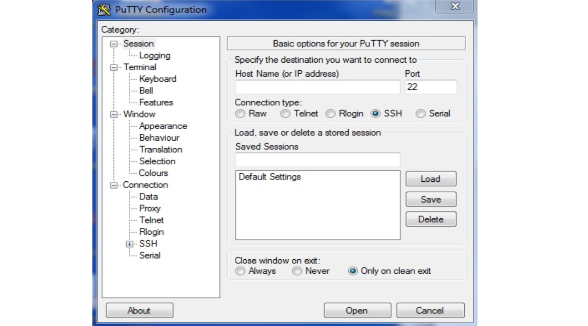
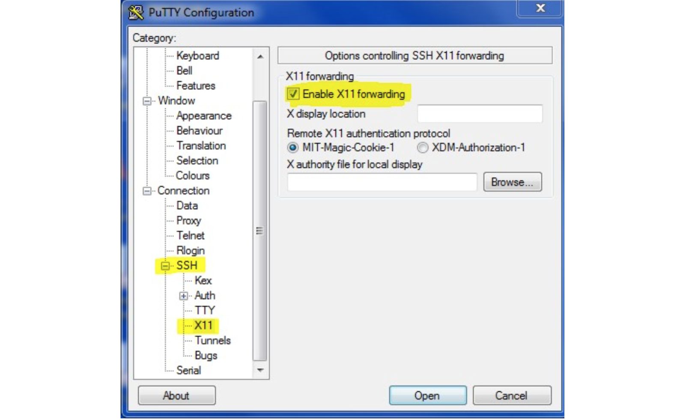
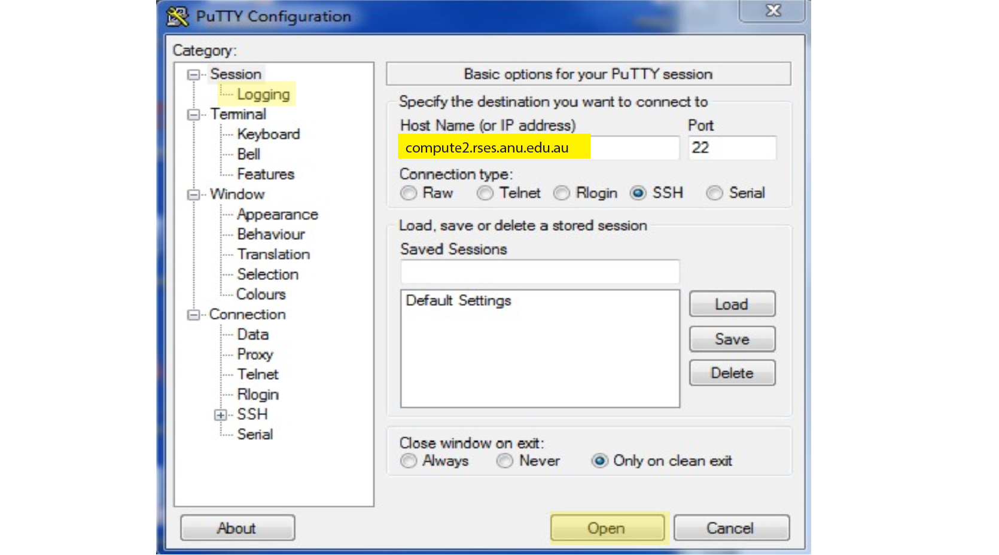
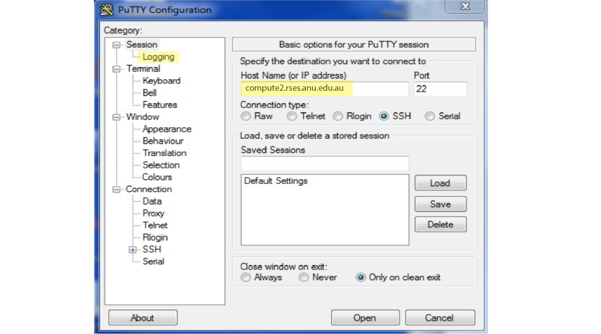
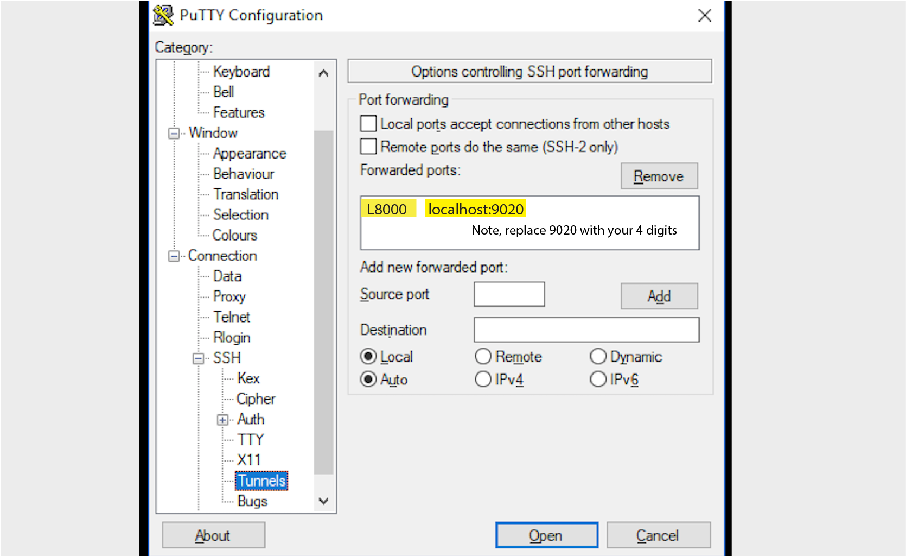

# 1. Log in to Linux server via Putty

This describe how to use Xming and Putty to access RSES server computers remotely. There are Xming and Putty already installed in all computers
in J8 LAB. Please follow these steps to log in to servers.

- Open Xming. Please do not surpise if nothing appears, it should be alright.

- Open putty. The screen shown below pops up
    

- Tick the **Enable X11 forwarding** forwarding as shown below.
    

- Go to **Logging**, type the host name *compute2.rses.anu.edu.au*"* and Port *22*, and "Open" as shown below.
    

- In the pop-up black window, follow the prompts and type your *username* (e.g., student02) and *password* (provided).

- Now, you are on the server `computer2`.

# 2. Log in to Jupyter-lab via Putty

- Open putty. The screen shown below pops up
    

- Go to **Logging**, type the host name *compute2.rses.anu.edu.au*"* and Port *22*. Do not click "Open" here.
    

- Go to **Connetion**-**SSH**-**Tunnels**. Type *8000* in "Source port" and *localhost:9020* in "Destination", and click "Add". Please replace the 9020 with your four digits. After adding you will get a row as shown below. Click the row to select it, and Click "Open".
    

- In the pop-up black window, follow the prompts and type your *username* (e.g., student02) and *password* (provided).

- Open a web browser, and go to `http://localhost:8000`. In the webpage, use the password provided. (Ask sheng.wang(at)anu.edu.au for your password if you forget)