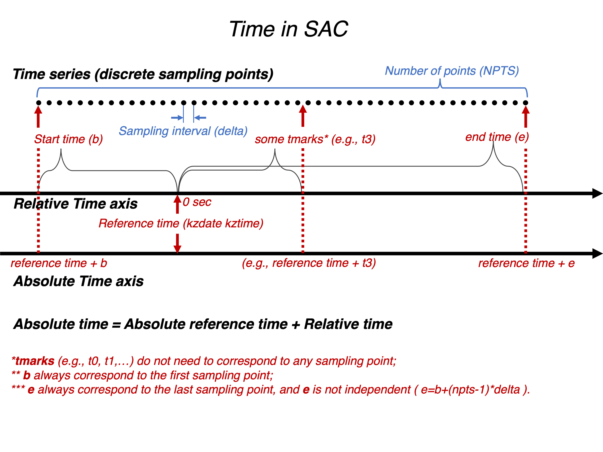

Lab1 - Locating earthquakes
=======

In this exercise, we examine sets of digital seismograms recorded at different stations around the globe with the object of determining the epicenters and origin times of the earthquakes. (An epicenter is the projection point on the earth’s surface of the real location; a hypocenter is the real location of the earthquake source. The origin time of the earthquake is usually expressed as UTC.) Please read the instructions in full before beginning and note the helpful commands given in the Unix/Linux command and SAC intro sheets.

# Part 1 (20 points)

Use Seismic Analysis Tool (`SAC`) to read in 3 components of seismograms for each of the stations in the `EQ1` directory.  **Examine all 3 components** of recorded ground motion (velocity, but please note that the vertical axes of seismograms are expressed in counts).

For each station, **estimate the time at which the P and S waves arrive**. You will use `ppk` to pick and `wh` to store the time. The P wave will be the first prominent arrival on the vertical component; the S wave should be the first prominent arrival showing on both horizontals that typically has smaller (or negligible) amplitude on the vertical component.  Pick the P wave on the vertical (BHZ) component and the S wave on one of the horizontal components (BHN or BHE).  Calculate the difference in arrival times (“S-P time”).  **Complete columns 2-4 of the accompanying table for the stations that are given to you**.  Be aware that other phases may arrive before the S (such as PP), which may lead to identification issues.

Run the `Jupyter-notebook` to **invert the epicentral distance and P wave traveltime** for each station.  The origin time can then be worked out by subtracting the P wave traveltime from the absolute P arrival time estimated above. For example, the inverted P wave traveltime is 1800 seconds (30 minutes) and the absolute P arrival time estimated is 2020-01-01T00:30:30, then the origin time is 2020-01-01T00:00:30. **Complete the last two columns of the table**. All origin times should be similar (within ~10-15 sec); if not, re-examine the seismograms and confirm the identification of P & S for the anomalous station(s). Take the average of the station estimates as the origin time of the earthquake.

**Construct a map** (directions follow) with a circle of constant radius (equal to the source-receiver distance) drawn around each station. All the circles should intersect at approximately one point. If any of the circles are inconsistent with the solution, go back and check your first steps for the appropriate station.

If the solution looks good, plot a closer view of the region around the epicentre and estimate as accurately as possible the coordinates of the earthquake. One way to do this is to find the point on the map that minimizes the sum of the distances (L1 norm) or distances squared (L2 norm) between the selected point and each of the circles. Write the estimated longitude and latitude on the lines of the attached table.

**Please submit the following**:
- [ ] the table you completed during the exercise,
- [ ] the maps produced by `equake` and `equakez`,
- [ ] a short summary detailing your thought process regarding picking any difficult phases and how the epicentral location could be improved by this method.

| Station | P arrival time | S arrival time | S-P (seconds) | Distance (degrees) | Origin time |
|---------|:--------------:|:--------------:|:-------------:|:------------------:|:-----------:|
|   ENH   |                |                |               |                    |             |
|   XAN   |                |                |               |                    |             |
|   NWAO  |                |                |               |                    |             |
|   ...   |                |                |               |                    |             |
*Average origin time from last column:	Time: ___________________*

*Epicentre estimate from map: 		Longitude: ___________________	 Latitude: ____________________*

**Hint: Conversion between relative time and absolute time**

# Part 2 (30 points)
### **Purpose**

The student should learn about basic principles involved in locating a local earthquake.

### **Note to PHYS3070 students**

This is a classical exercise developed at University of California, Berkeley to help students appreciate the methodology behind locating earthquakes. This used to be done with a paper and pencil only; of course more contemporary equivalent are sophisticated computer programs, which are available to assist data analysts (in part III, you will write your own program to determine the location of the earthquake that will be analyzed here). A routine analysis of the local and regional seismicity in Australia is being done at Geoscience Australia.  

### **Materials needed**

1. Seismograms from a local earthquake (in this example: a California earthquake) written at three seismographic stations operated by a regional network.
2. Map of central California showing the locations of the seismographic stations (provided).
3. Travel time curves for local P and S waves in California (provided).
4.  Millimetre scale and a compass for drawing circles.

### **References**

B. A. Bolt - Earthquakes, Chapter 3 (optional reading)

### **A. Seismograms**

Sections of seismograms written at three seismographic stations in California are [provided](https://github.com/sheng09/PHYS3070-2020/blob/master/Week2/Cal_Eq.pdf). These sections are all for the same period of time and the time in hours and minutes is written next to one of the minute marks. This is UTC time. These seismograms are all for the vertical component of motion. They are short-period Benioff instruments, with a natural period of 1 second, and a peak magnification of about 30,000.
The objective of this exercise is to locate a typical local earthquake. By local we mean that the earthquake is either within or near region spanned by the seismographic network. The seismograms for this earthquake are fairly typical in that they are not of particularly high quality and illustrate some of the difficulties that are encountered in the routine operation of a seismographic network. One of the lessons to be learned from this exercise is that useful information can often be extracted from even a seismogram of poor quality.

### **B. Arrival times**

For local earthquakes, the two seismic waves of primary interest are the first P wave and the first S wave. Because of the velocity of P waves is always greater than that of S waves, the P wave always precedes the S wave. Thus, we generally begin with searching for the P wave. This should be the first phase on the seismogram, at least the first phase that is related to the particular seismic event we are studying. Once a phase has been identified which may possibly be the first P wave, we look at later times to see if the first S wave can be identified. Finding this phase for the first S wave is generally much more difficult than the P wave, primarily because it arrives at a time when the trace is already in a disturbed state caused by the arrival of the P wave and other phases associated with it. Thus, sometimes a phase that can be associated with the first S wave can be confidently identified, sometimes a phase can be identified but there remains considerable uncertainty whether it actually is the first S wave, and sometimes it is not possible to identify any phase that can be associated with the S wave.

A common practice is to place a reading in parenthesis if it is uncertain. Thus (S) 12h 14m 25.3s indicates the arrival time of a phase for which the beginning of the phase can be clearly read but the phase is only tentatively identified as the S wave. Similarly, S 12h 14m (26)s indicates the arrival time of a phase which appears to be the S wave but there is some uncertainty concerning just where the phase begins. Finally, it is often necessary to use trial and error in this process of identifying phases. The initial identification and association of phases should be regarded as working hypotheses, and later analysis may cause us to come back and re-examine our results.

__***B1. Estimate the arrival times of P and S phases at the three stations. Denote the phase identifications of arrival times that are uncertain. Tabulate these arrival times for each station.***__

### **C. Locating the Epicentre**

The locations of the seismographic stations are plotted on the accompanying map. Also included is a travel time graph for P and S waves in central California. Given these two figures and the arrival times measured in the previous section, you can now locate the epicentre of this earthquake and determine its origin time. Note that distance on this travel time graph is measured in kilometres. Also note that the travel time curves for different types of crustal phases are included on the graph. However, because you measured the first P wave and the first S wave on the seismogram, you should use the first-arriving P and first-arriving S phase at any distance. 

In locating this earthquake it is possible to take advantage of the fact that P and S waves have different velocities in the earth. Because of this, the time interval between the arrival of the P and S waves on travel time curves is a monotonic increasing function of distance. Thus, if the arrival times of the P wave and S wave can be obtained at the same station, the difference tS – tP can be used to estimate the distance of the station from the epicentre. Furthermore, knowing the distance, also gives us the travel time of the P wave, which can be subtracted from tP to give an estimate of the origin time t0. This approach should be sufficient to locate the earthquake being studied in the present exercise. Note that you will obtain a separate estimate of the origin time for each station where a P and S phase is read. If these are not in reasonable agreement, then you might want to go back and re-evaluate your selection and timing of the phases. Also note that in principle one needs a minimum of three stations to uniquely determine the epicentre, but even a small amount of information from some of the stations may be sufficient.

__***C1. Estimate the epicentre and origin time of this earthquake. You may want to leave the final version of the arcs (in light pencil lines) on your map.***__

__***C2. Estimate the accuracy of your results (epicentre and origin time) and explain the basis of your estimate.***__

### **D. Summary**

Review your analysis of this earthquake and evaluate the methods that you have used. The following questions should help in this review.

__***D1. Consider the assumptions you made in locating this earthquake. What have you assumed about the depth of the earthquake? What have you assumed about the lateral changes in the structure of the Earth?***__

__***D2. The PRI seismogram is an interesting example where the travel times of the phases are quite difficult to read with confidence. From the solution you obtained for the epicentre, what are the predicted arrival times of P and S at this station? How do these predictions compare with what you see on the seismogram? What information on the seismogram did you actually use in locating this event?***__

# Part 3 (50 points)

**Write** a program in Mathematica or Fortran (or C) to estimate the earthquake epicenter location based on the observed P and S travel times (emulating Part II).

**Estimate** as precisely as you can the station coordinates from the attached map.

Your computer program should:

- **assume** a homogeneous earth model with P-wave velocity of 8.0 km/s and S-wave velocity of 4.5 km/s (instead of using the attached empirical travel time curve like we do in Part II)
- **assume** that the earth is flat (**use** Cartesian coordinates) and that 1 degree is equal to 111.195 km
- **assume** that the earthquake hypocenter is near the surface
- **use** the P and S travel times estimated for stations JAS and MHC from part II as an input to **find** analytical solutions for the coordinates of the intersections of two circles (equivalent to the epicentral distance similar to the equake program in Part I).
- use the information gathered from the third station (PRI) to **determine** which of the two intersections is the location of the epicenter (tip: as you can see, it is impossible to estimate the arrival time of the S wave. Use conditional statements in your program to **exploit the information** that you can gather from the third station.)

The geometry of the problem (before using the third station) looks approximately like the plot below (the stations and intersections are shown):

**Generalize** the input to your program for **different station coordinates and input travel times** to obtain estimates for earthquake epicenter for any 3 seismograms, where both the P and S travel times are known only for two of them, whilst the third seismogram only contains a partial (but key) information. The output from the program should contain: input station names and corresponding geographical coordinates and travel times, and the resulting epicenter coordinates.

**Please submit**

- Your Python, Mathematica/Matlab, Fortran or C programs (it should work when executed), with full commenting
- The output from the program,
- The map with the solution (you can use a compass to draw circles),
- A report. In your report, please answer the following questions:
  - Why you designed the computer program the way you did?
  - There is one special case when the approach of using P and S waves arrival from only two stations, and the third station that does not contain S wave arrival times, will fail. Please explain.
  - In your opinion, is this a robust method for earthquake location?
  - What are the assumptions (both necessary and imposed) going into the theory of the problem?
  - How you would have written a code to explicitly determine the true epicenter (What additional factors would you have had to know?)
  - How you would have written the code differently if you instead had to determine the hypocenter, and in what way the results would have changed?

