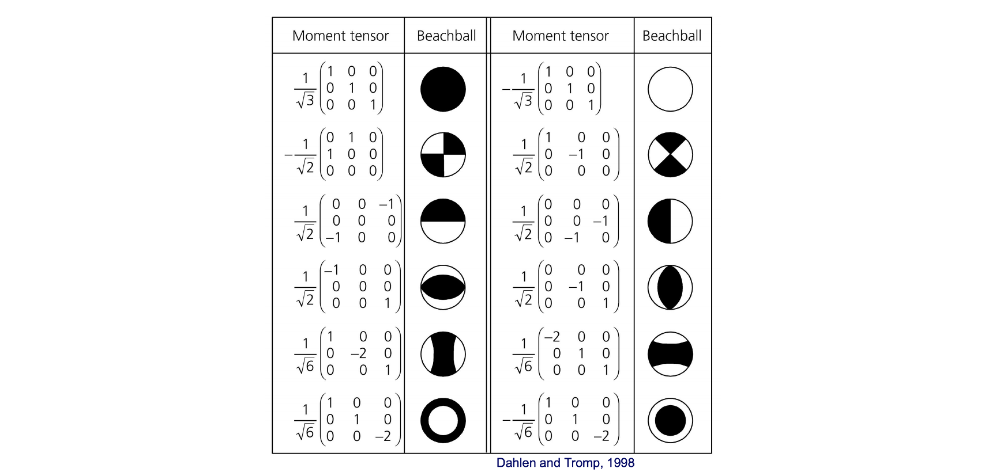

Time-Domain Moment Tensor Inversion
====

The objective of this lab is to learn how to invert the focal mechanism of a real earthquake from seismic recordings (seismograms) of the earthquake. The focal mechanism is an important parameter that describes the dynamics of the earthquake (as shown below).

The 1st section explains the basics for moment tensor inversion. The 2nd section presents examples for step-by-step inversion for a real earthquake. The 3rd section list tasks/problems for students to solve.

# 1. Basic Methodology and Program Assumptions

The general representation of seismic sources is simplified by considering both a spatial and
temporal point-source. The seismograms are:

Un is the observed nth component of displacement, Gni,j is the nth component Green’s function
for specific force-couple orientations, and Mij is the scalar seismic moment tensor, which
describes the strength of the force-couples. The general force-couples for a deviatoric moment
tensor may be represented by three fundamental-faults, namely a vertical strike-slip, a vertical
dip-slip, and a 450 dip-slip. The indices i and j refer to geographical directions. 

Based on the above equation, we can invert the Mij if we know the Un (the recorded seismograms) and the Gni,j (we can simulate it for a given source depth and an Earth structure model). We can solve it using linear least squares. In this distribution only the deviatoric seismic moment tensor is solved for, and the inversion yields the Mij which is decomposed into the scalar seismic moment, a double-couple moment tensor and a compensated linear vector dipole moment tensor. The decomposition is represented as percent
double-couple (Pdc) and percent CLVD (PCLVD). Percent isotropic (PISO) is always zero 
for this deviatoric application. The double-couple is further represented in terms of the strike, 
rake and dip of the two nodal planes. The basic methodology and the decomposition of the 
seismic moment tensor is described in Jost and Herrmann (1989).

Source depth is found iteratively by finding the solution that yields the largest variance
reduction,

where *data*, and *synth* are the data and Green’s function time series, respectively, and the
summation is performed for all stations and components.
Another measure that is useful for determining source depth in regions where explosive
events are unlikely is the RES/Pdc, the variance divided by the percent double-couple where,

Dividing the variance by the percent double-couple tends to deepen the minimum.

It is assumed that the event location is well represented by the high frequency hypocentral
location, and a low frequency centroid location is not determined. Second, the simplified
representation above assumes that the source time history is synchronous for all of the
moment tensor elements and that it may be approximated by a delta function. These
assumptions are generally reasonable for Mw<7.5 events since long period waves (>10-20s)
are used. It is noted however, that for larger events these point-source assumptions break
down in the period range employed and alternative finite fault approaches (e.g. Dreger and
Kaverina, 2000) or longer period waves and larger source-station distances (e.g. Fukuyama
and Dreger, 2000) are required.

Finally, it is assumed that the crustal model is sufficiently well known to explain low
frequency wave propagation. This software package will not work in a region if calibrated
velocity models are not available. Calibrating velocity models to obtain a robust catalog of
Green’s functions is singly the most important step in successful seismic moment tensor
applications.

In California, it was found that three 1D velocity models are adequate for the recovery of the
seismic moment tensor. Different monitoring regions may require fewer or more crustal
velocity models. Crustal velocity models that are sufficient for moment tensor analysis may
be derived from models used to locate earthquakes, or by modeling of the broadband
seismograms. There are numerous papers in the literature that describe how to model 3-
component waveforms to constrain velocity structure and these (e.g. Dreger and Helmberger,
1990, 1993; Dreger and Romanowicz, 1994; Rodgers et al., 1999; Zhao and Helmberger,
1991; Song et al., 1996) are some examples for getting started. Two- and three-dimensional
models may be used provided that the codes used to synthesize the Green’s functions
produces the full compliment of fundamental-fault responses.

# 2. Examples

Examples are provided in the jupyter notebook as we used in lab. The notebook is well-documented 
by itself for step-by-step runnings.

# 3. Tasks/Problems

## 3.1 Task 1

By considering broadband data from 3 stations, determine the best fitting moment tensor solution for this event. This means that you will have to investigate a range of depths. You should obtain the best result (the highest variance reduction). Show your best result on a plot. Find the
best fitting depth and show the variance reduction as a function of depth.
What can you say about the geometry of the fault that ruptured from the “beach ball” diagram
that you obtained?

## 3.2 Task 2

Bring in the forth station, and repeat the procedure. You can assume that the depth
you obtained in Task 1 is the correct depth (so you do not need to investigate different depths
any more). Show your best result on a plot. 

Finally, bring in more stations of your choice. Consider the azimuth of each remaining station and select the station that has a good signal to noise ratio, and will at the same time fill in the azimuthal gap. Show your best solution. What can you say about the final goodness of the fit? Does the increasing number of stations result in the increasing variance reduction? Explain why this might or might not be the case. (hint: think about the assumptions we made, starting from the consideration of the initial structural model).

## 3.3 Task 3

Increase the crustal thickness by changing the thickness of the sixth layer from 8 to 16 km in the
model file (`gil7.d`). This means that we are now considering a perturbed earth model (which might be less
accurate), which will result in different synthetic seismograms. By considering broadband
data from only 3 stations (same as in Task 1), determine the best fitting moment tensor solution. Show your best result on a plot. Find the best fitting depth and show the variance reduction as a function of depth. How do
these results compare with those obtained in Task 1? What can you say about the variance
reduction and the depth estimate? Are the waveform fits poorer or better now and why?